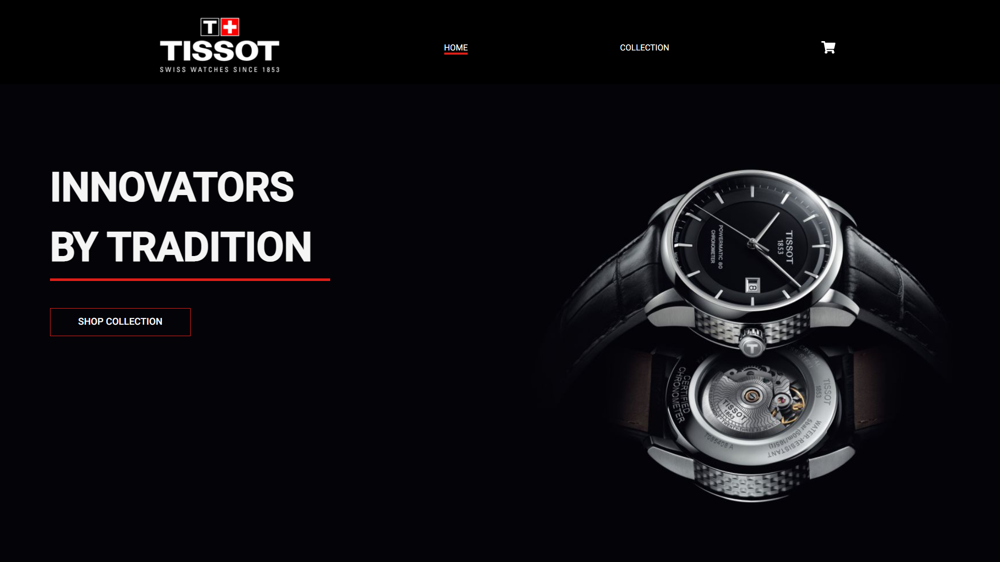
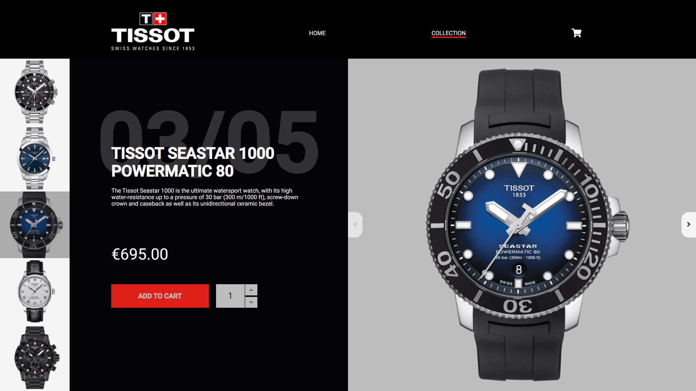
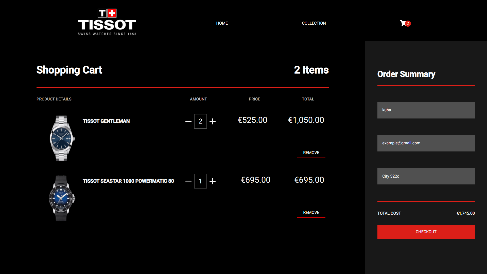
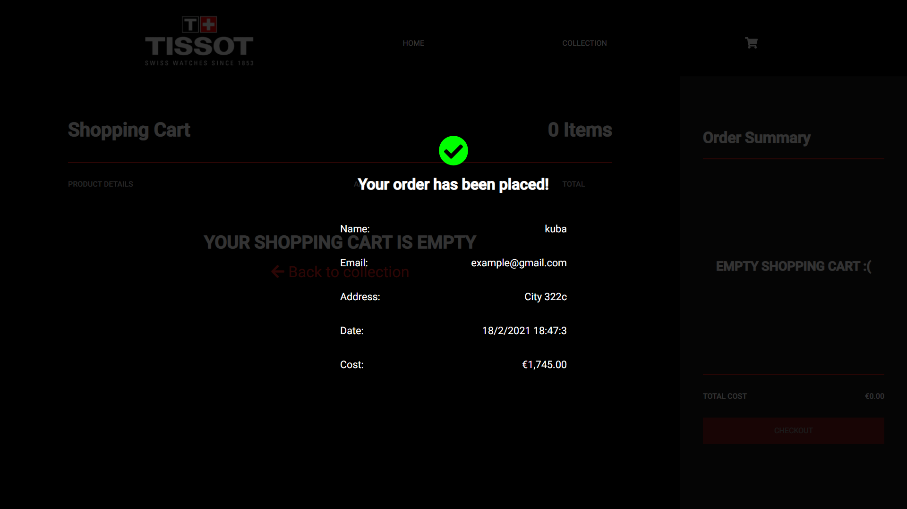

## CHECK IT ONLINE!

https://watch-store-react.herokuapp.com/

<p align="center">

  <h2 align="center">Tissot Store</h2>

  <p align="center">
   React application about watches store.
    <br />
  </p>
</p>

## About The Project


<br>

<br>

<br>


<p align="center">
React shopping cart with Tissot watches, user can browse the store's offer, add product to cart. After entering the
data in the form, order will be saved in json file due to custom backend with express.js. User can also check all
orders.
</p>

### Installing

Clone the Repository and run

```
npm install
npm run build
npm start
```

### Built With

-  React
-  Redux
-  React-Query
-  Styled Components
-  React Final Form
-  Java Script
-  Responsive Web Design
-  Node.js
-  Express.js
